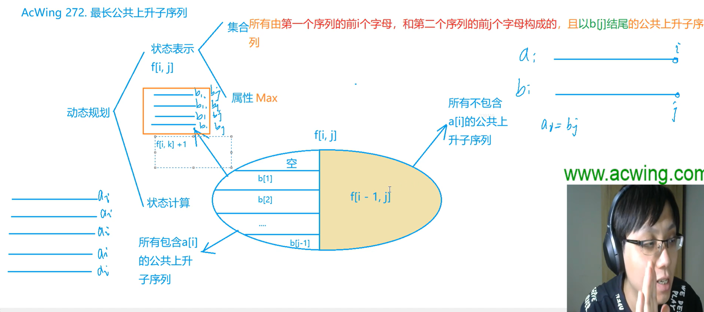

# DP动规学习笔记

ps: [MarkDown支持高亮的语言点击查看](https://blog.csdn.net/u012102104/article/details/78950290)
### 11/19看到1.1 数字三角形模型
```cpp
    cin >> t;
	while (t--) {
		memset(f, 0, sizeof f);
		memset(p, 0, sizeof p);
		int r, c;
		cin >> r >> c;
		for (int i = 1; i <= r; i++) {
			for (int j = 1; j <= c; j++) {
				cin >> p[i][j];
			}
		}
		for (int i = 1; i <= r; i++) {
			for (int j = 1; j <= c; j++) {
				f[i][j] = max(f[i - 1][j] + p[i][j], f[i][j - 1] + p[i][j]);
			}
		}
		cout << f[r][c] << endl;
	}
```

### 12/2 最长上升子序列模型（1）
**基础模版：**
```cpp
#include<iostream>
#include<algorithm>
using namespace std;
const int N =1010;
int a[N];
int f[N];
int main(){
    //输入
    int n;
    cin >> n;
    for (int i = 0; i < n; i++) {
        cin >> a[i];
    }
    //求最长子序列和 & 最长子序列
    int res = 0;
    for (int i = 0; i < n; i++) {
        f[i] = a[i];
        //f[i] = 1;
        for (int j = 0; j < i; j++) {
            if (a[i] > a[j]) {
                f[i] = max(f[i], f[j] + a[i]);
                // f[i] =max (f[i], f[j] + 1)
            }
        }
        res = max(res, f[i]);
    }
    return 0;
}
```

**最长上升子序列O(nlogn)复杂度代码：**
（二分+动态规划）
思路：首先数组a中存输入的数（原本的数），开辟一个数组f用来存结果，最终数组f的长度就是最终的答案；假如数组f现在存了数，当到了数组a的第i个位置时，首先判断a[i] > f[cnt] ？ 若是大于则直接将这个数添加到数组f中，即f[++cnt] = a[i];这个操作时显然的。
当a[i] <= f[cnt] 的时,我们就用a[i]去替代数组f中的第一个大于等于a[i]的数，因为在整个过程中我们维护的数组f 是一个递增的数组，所以我们可以用二分查找在 logn 的时间复杂的的情况下直接找到对应的位置，然后替换，即f[l] = a[i]。

我们用a[i]去替代f[i]的含义是：以a[i]为最后一个数的严格单调递增序列,这个序列中数的个数为l个。

这样当我们遍历完整个数组a后就可以得到最终的结果。

时间复杂度分析：O(nlogn)

```cpp
#include<iostream>

using namespace std;
const int N = 1e5 + 10;
int cnt = 0;
int n;
int a[N], f[N];

int find(int x) {
	int left = 1;
	int right = cnt;
	while (left < right) {
		int mid = (left + right) / 2;
		if (x <= f[mid]) {
			right = mid;
		}
		else left = mid + 1;
	}
	return left;
}


int main() {
	cin >> n;
	for (int i = 1; i <= n; i++) {
		cin >> a[i];
	}
	f[++cnt] = a[1];
	for (int i = 2; i <= n; i++) {
		if (a[i] > f[cnt])f[++cnt] = a[i];
		else {
			int l = find(a[i]);
			f[l] = a[i];
		}
	}
	cout << cnt;
	return 0;
}
```


**进阶题型——登山**
需要正向求一次最长上升子序列，再反向求一次，最后寻找最大值

```cpp
for (int i = 0; i < n; i++) {
            f[i]=1;
            for (int j = 0; j < i; j++) {
                if (a[i] > a[j]) {
                    f[i] = max(f[i], f[j] + 1);
                }
            }
        }

        for (int i = n - 1; i >= 0; i--) {
            h[i]=1;
            for (int j = n - 1; j > i; j--) {
                if (a[i] > a[j]) {
                    h[i] = max(h[i], h[j] + 1);
                }
            }
        }
        int max1 = 0;
        for (int i = 0; i < n; i++) {
            //注意：此处需要-1是因为双向的交点重合了！！！
            max1 = max(max1, h[i]+f[i]-1);
        }

```


### 12/4 最长上升子序列模型（2）

[题目：导弹拦截](https://www.acwing.com/problem/content/1012/)
```cpp
#include<iostream>
#include<algorithm>

using namespace std;
const int N =1010;

int n;
int a[N];
int f[N];
int h[N];

int main(){
    while(cin>>a[n])n++;
    //for(int i=0;i<n;i++)cout<<a[i];
    
    /*第一问：求最长下降子序列*/
    int ans1= 0;
    for(int i=0;i<n;i++){
        f[i]=1;
        for(int j=0;j<i;j++){
            if(a[i]<=a[j]){
                f[i] = max (f[j]+1,f[i]);
            }
        }
        ans1 = max (ans1,f[i]);
    }
    cout<<ans1<<endl;
    
    /*第二问：求最长下降子序列
    
    
    思路1：（代码略）
    设最长上升子序列长度为l
    所求上升子序列为h
    那么h<=l
    因为最长上升子序列任意两个不在一组内
    (如果在同一个组内，则每个组的数不成为一个不生子序列，矛盾）
    所以l==h
    
    思路2：贪心
    
    */
    int cnt = 0;
    for(int i=0;i<n;i++){
        int k = 0;
        while(k<cnt&&a[i]>h[k])k++;
        if(k == cnt )h[cnt++] = a[i];
        else h[k] = a[i];
        
    }
    cout <<cnt;
    return 0;
}
```

[导弹防御系统](https://www.acwing.com/problem/content/189/)

```cpp
#include<iostream>
#include<algorithm>

using namespace std;
const int N =55;
int a[N];
int up[N];
int down[N];
int n;
int ans;
void dfs (int u,int su,int sd){
    if(su+sd>=ans){
        return ;
    }
    if(u==n){
        ans = min(ans,su+sd);
        return ;
    }
    //下降序列
    int k=0;
    while(k<su&&up[k]>=a[u])k++;
    if(k<su){
        int t =up[k];
        up[k] = a[u];
        dfs(u+1,su,sd);
        up[k] = t;
    }else {
        up[k] = a[u];
        dfs(u+1,su+1,sd);
    }
    
    //上升序列
    k=0;
    while(k<sd&&down[k]<=a[u])k++;
    if(k<sd){
        int t = down[k];
        down[k] = a[u];
        dfs(u+1,su,sd);
        down[k] = t; 
    }else {
        down[k] = a[u];
        dfs(u+1,su,sd+1);
    }
    
}

int main(){
   
    while(cin>>n,n){
        //cin>>n;
        for(int i =0 ;i<n;i++){
            cin>>a[i];
        }
        ans = n ;
        dfs(0,0,0);
        cout<<ans<<endl;
    }
    
    
    return 0;
}
```
[题目：最长上升公共子序列](https://www.acwing.com/problem/content/274/)



```cpp
#include<iostream>

using namespace std;
const int N=3010;
int a[N];
int b[N];
int f[N][N];


int main(){
    int n;
    cin>>n;
    for(int i=1;i<=n;i++)cin>>a[i];
    for(int j=1;j<=n;j++)cin>>b[j];
    
    for(int i=1;i<=n;i++){
        int max1=1;
        for(int j=1;j<=n;j++){
            f[i][j] = f[i-1][j];
            if(a[i]==b[j]){
                f[i][j] = max(max1,f[i][j]);
            }
            if(b[j]<a[i])max1 = max(max1,f[i-1][j]+1);
        }
    }
    int res = 0;
    for(int i=1;i<=n;i++)res =max(res,f[n][i]);
    cout <<res;
    
    return 0;
}
```


### 12/15 背包模型（1）
复习：[背包模型基础模版](https://blog.csdn.net/hehongfei_/article/details/136474781)


**当空间优化成1维之后，只有完全背包问题的体积是从小到大循环的**

[宠物小精灵之收服](https://www.acwing.com/problem/content/1024/)
做01背包问题的时候，要考虑怎么找出体积和价值


```cpp
#include<iostream>

using namespace std;
const int N =1010;
const int M =510;
int n , m, k;
int f[N][M];


int main(){
    cin>>n>>m>>k;//N，M，K，分别代表小智的精灵球数量、皮卡丘初始的体力值、野生小精灵的数量。
    for(int i=0;i<k;i++){
        int v1,v2;
        cin>>v1>>v2;
        for(int j=n;j>=v1;j--){
            for(int s=m;s>v2;s--){
                f[j][s] = max(f[j][s],f[j-v1][s-v2]+1);
            }
        }
    }
    cout<<f[n][m]<<" ";
    
    int x = m;
    while(x>0&&f[n][x]==f[n][m])x--;
    cout<<m-x;
    
    //输出为一行，包含两个整数：C，R，分别表示最多收服C个小精灵，以及收服C个小精灵时皮卡丘的剩余体力值最多为R。
    
    return 0;
}
```

### 12/17 背包模型（2）
[二维费用的背包问题](https://www.acwing.com/problem/content/8/)


```cpp

#include<iostream>

using namespace std;
const int MM=1010;
int f[MM][MM];
int main(){
    int N,V,M;
    cin>>N>>V>>M;
    
    for(int i=0;i<N;i++){
        int v,m,w;
        cin>>v>>m>>w;
        for (int j=V;j>=v;j--){
            for(int k = M;k>=m;k--){
                f[j][k] = max(f[j][k],f[j-v][k-m]+w);
            }
        }
    }
    cout<<f[V][M];
    return 0;
}
```

变式：[潜水员](https://www.acwing.com/problem/content/1022/)

“至少”：当j-v2小于0，但是“至少是j”，说明存在j会使j-v2>=0成立，所以当j-v2小于0时，我们令其为0.


```cpp
#include<iostream>
#include<cstring>
using namespace std;
const int MM=1010;
int f[MM][MM];
int main(){
    int N,V,M;
    cin>>V>>M;
    cin>>N;
    memset(f,0x3f,sizeof f);
    f[0][0]=0;
    for(int i=0;i<N;i++){
        int v,m,w;
        cin>>v>>m>>w;
        for (int j=V;j>=0;j--){
            for(int k = M;k>=0;k--){
                f[j][k] = min(f[j][k],f[max(0,j-v)][max(0,k-m)]+w);
            }
        }
    }
    cout<<f[V][M]<<endl;
    return 0;
}
```
[数字组合](https://www.acwing.com/problem/content/280/)


```cpp
#include<iostream>

using namespace std;
const int N =10010;
int f[N];
int main(){
    int n,m;
    cin>>n>>m;
    f[0]=1;
    for(int i=1;i<=m;i++)f[i]=0;
    for(int i=0;i<n;i++){
        int v;
        cin>>v;
        for(int j=m;j>=v;j--){
            f[j]+=f[j-v];
        }
    }
    cout<<f[m];
    return 0;
}
```


### 12/21 背包模型（3）

背包问题求具体方案
[题目：背包问题求具体方案](https://www.acwing.com/problem/content/12/)
以01背包为例
思路：首先是如何求方案：在最后求出结果后，从最后往前推，看分别是选的哪个记录一下。
如果要求选出的物品字典序最小，采取贪心的思路，从字典序从小到大（因此我们第一步的求最值可以序号从大到小求，这样求方案的时候就能从小到大求了）

```cpp
#include<iostream>

using namespace std;
const int N = 1010;
int v[N],w[N];
int f[N][N];

int main(){
    int n,m;
    cin>>n>>m;//分别表示物品数量和背包容积。
    for(int i=1;i<=n;i++)cin>>v[i]>>w[i];
    
    for(int i=n;i>=1;i--){
        for(int j=0;j<=m;j++){
            f[i][j] = f[i+1][j];
            if(j>=v[i]){
                f[i][j] = max(f[i][j],f[i+1][j-v[i]]+w[i]);
            }
        }
    }
    //max:f[1][m]
    int j = m;
    for(int i=1;i<=n;i++){
        if(j>=v[i]&&f[i][j]==f[i+1][j-v[i]]+w[i]){
            cout<<i<<" ";
            j-=v[i];
        }
    }
    
    
    return 0;
}
```

分组背包问题


```cpp
#include<iostream>

using namespace std;
const int N =110;
int v[N][N],w[N][N];
int f[N][N];
int s[N];


int main(){
    int n,m;
    cin>>n>>m;
    for(int i=1;i<=n;i++){
        cin>>s[i];
        for(int j=0;j<s[i];j++){
            cin>>v[i][j]>>w[i][j];
        }
    }
    
    //前i个物品，占多少体积，怎么选
    for(int i=1;i<=n;i++){
        for(int j=0;j<=m;j++){
            //for(int k=0;k<v)
            f[i][j] = f[i-1][j];
            for(int k=0;k<s[i];k++){
                if(j>=v[i][k]){
                    f[i][j] = max(f[i][j],f[i-1][j-v[i][k]]+w[i][k]);
                }
            }
            
        }
    }
    cout<<f[n][m]<<endl;
    
    return 0;
}

```


