# 深度学习入门——基于 Python 的理论与实现

## 第一章：感知机

感知机接收多个输入信号，输出一个信号。感知机的多个输入信号都有各自固有的权重，这些权重发挥着控制各个信号的重要性的作用。也就是说，权重越大，对应该权重的信号的重要性就越高。

“单层感知机无法表示异或门”或者“单层感知机无法分离非线性空间”。通过组合感知机（叠加层）就可以实现异或门。
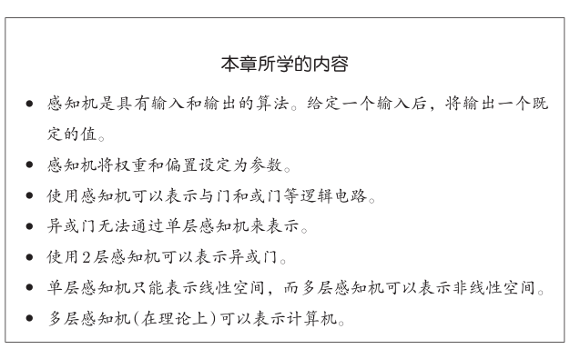

## 第二章：神经网络

用图来表示神经网络的话，如图所示。我们把最左边的一列称为输入层，最右边的一列称为输出层，中间的一列称为中间层。中间层有时也称为隐藏层。“隐藏”一词的意思是，隐藏层的神经元（和输入层、输出层不同）肉眼看不见.
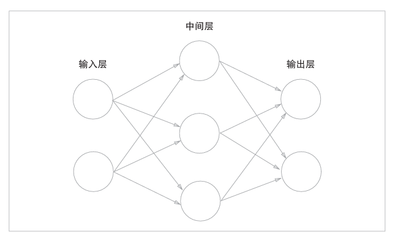

### 激活函数

激活函数是连接感知机和神经网络的桥梁

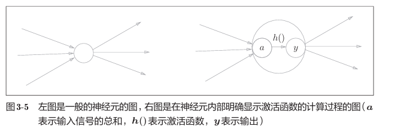

神经网络的激活函数必须使用非线性函数。换句话说，激活函数不能使用线性函数。为什么不能使用线性函数呢？因为使用线性函数的话，加深神经网络的层数就没有意义了。线性函数的问题在于，不管如何加深层数，总是存在与之等效的“无隐藏层的神经网络”。

常见的激活函数：阶跃函数、sigmoid函数、ReLU（Rectified Linear Unit）函数。
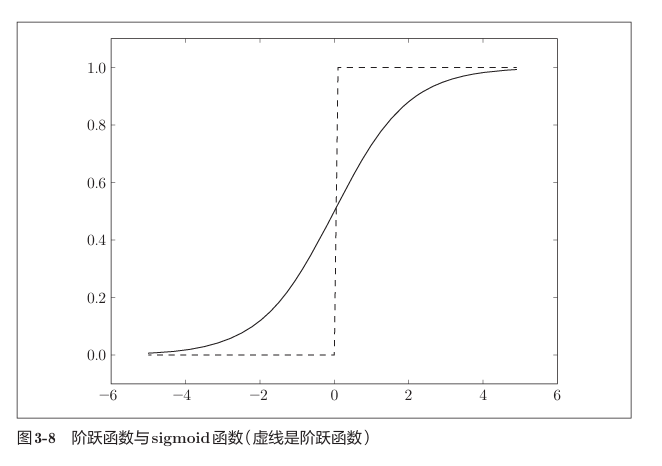

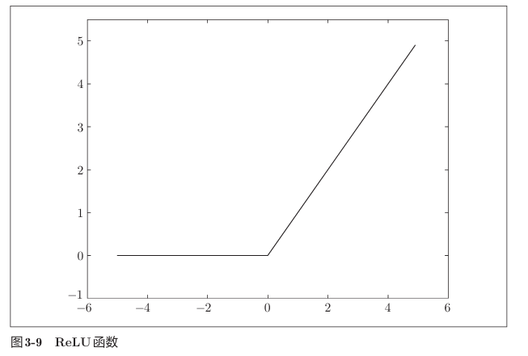

### 矩阵乘法
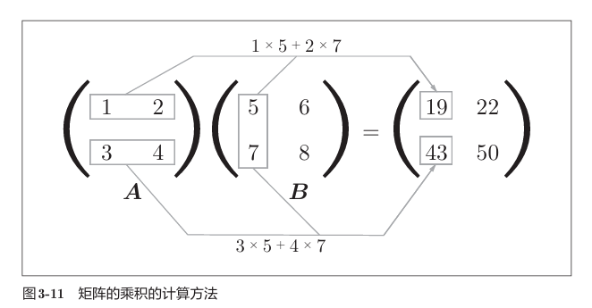

forward（前向）：是从输入到输出方向的传递处理

backward（后向）：从输出到输入方向的处理

### 输出层的设计

神经网络可以用在分类问题和回归问题上，不过需要根据情况改变输出层的激活函数。一般而言，回归问题用恒等函数，分类问题用softmax函数。
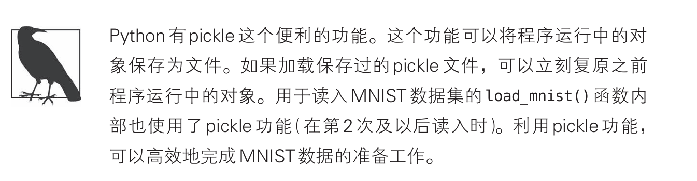

## 第三章：神经网络的学习

本章的主题是神经网络的学习。这里所说的“学习”是指从训练数据中自动获取最优权重参数的过程。

机器学习中，一般将数据分为训练数据和测试数据两部分来进行学习和实验等。首先，使用训练数据进行学习，寻找最优的参数；然后，使用测试数据评价训练得到的模型的实际能力。为什么需要将数据分为训练数据和测试数据呢？因为我们追求的是模型的泛化能力。为了正确评价模型的泛化能力，就必须划分训练数据和测试数据。另外，训练数据也可以称为监督数据。
泛化能力是指处理未被观察过的数据（不包含在训练数据中的数据）的能力。获得泛化能力是机器学习的最终目标。
顺便说一下，只对某个数据集过度拟合的状态称为过拟合（over fitting）。 避免过拟合也是机器学习的一个重要课题

### 损失函数

这里的幸福指数只是打个比方，实际上神经网络的学习也在做同样的事情。神经网络的学习通过某个指标表示现在的状态。然后，以这个指标为基准，寻找最优权重参数。和刚刚那位以幸福指数为指引寻找“最优人生”的人一样，神经网络以某个指标为线索寻找最优权重参数。神经网络的学习中所用的指标称为损失函数（loss function）。这个损失函数可以使用任意函数，但一般用均方误差和交叉熵误差等。

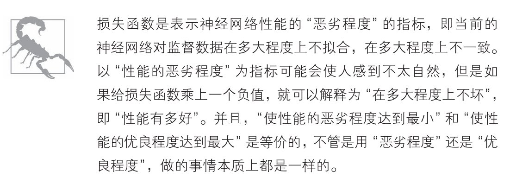

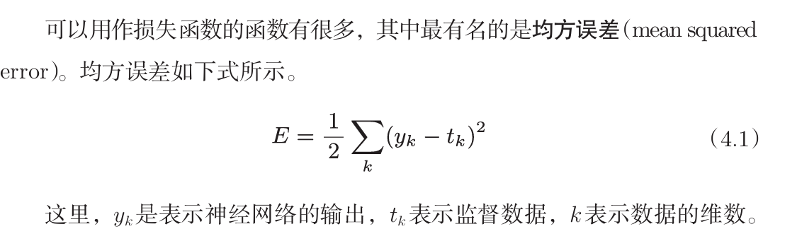

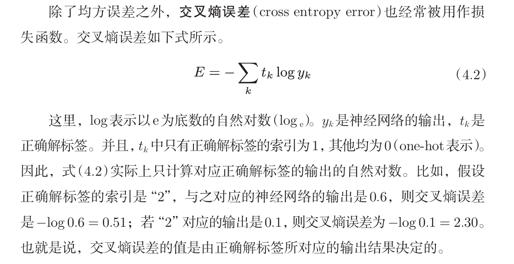

### mini-batch学习
如果遇到大数据，数据量会有几百万、几千万之多，这种情况下以全部数据为对象计算损失函数是不现实的。因此，我们从全部数据中选出一部分，作为全部数据的“近似”。神经网络的学习也是从训练数据中选出一批数据（称为mini-batch,小批量），然后对每个mini-batch进行学习。比如，从60000个训练数据中随机选择100笔，再用这100笔数据进行学习。这种学习方式称为**mini-batch学习。**

### 为何要设置损失函数

对于这一疑问，我们可以根据“导数”在神经网络学习中的作用来回答。下一节中会详细说到，在神经网络的学习中，寻找最优参数（权重和偏置）时，要寻找使损失函数的值尽可能小的参数。为了找到使损失函数的值尽可能小的地方，需要计算参数的导数（确切地讲是梯度），然后以这个导数为指引，逐步更新参数的值。

**在进行神经网络的学习时，不能将识别精度作为指标。因为如果以识别精度为指标，则参数的导数在绝大多数地方都会变为0。**

### 梯度

梯度指示的方向是各点处的函数值减小最多的方向。
机器学习的主要任务是在学习时寻找最优参数。同样地，神经网络也必须在学习时找到最优参数（权重和偏置）。这里所说的最优参数是指损失函数取最小值时的参数。但是，一般而言，损失函数很复杂，参数空间庞大，我们不知道它在何处能取得最小值。而通过巧妙地使用梯度来寻找函数最小值（或者尽可能小的值）的方法就是梯度法。
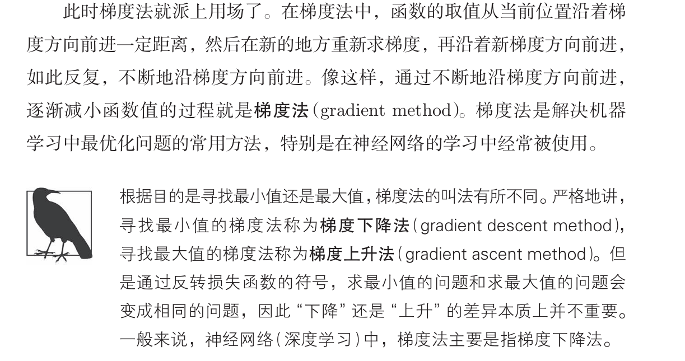

随机梯度下降法SGD

#### 学习率

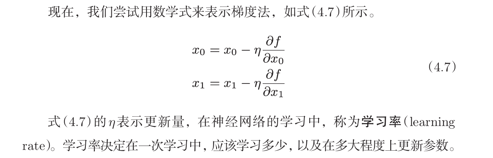

实验结果表明，学习率过大的话，会发散成一个很大的值；反过来，学习率过小的话，基本上没怎么更新就结束了。也就是说，设定合适的学习率是一个很重要的问题。
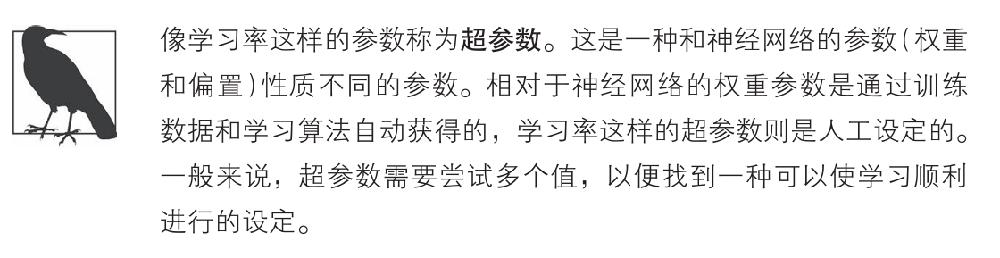

## 第五章 误差反向传播法

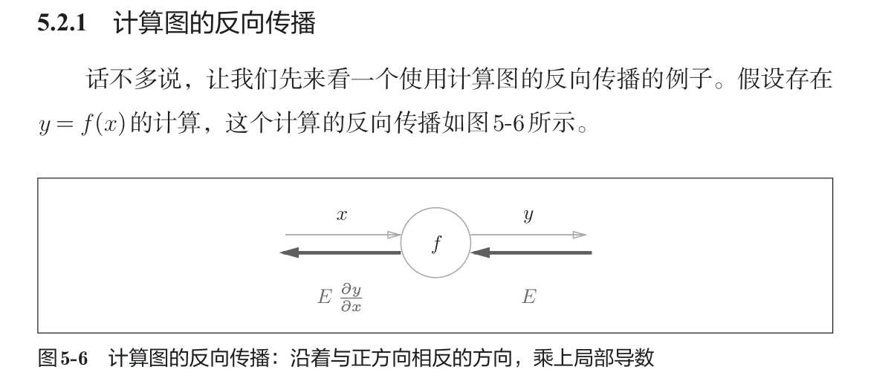

### 激活函数层的实现

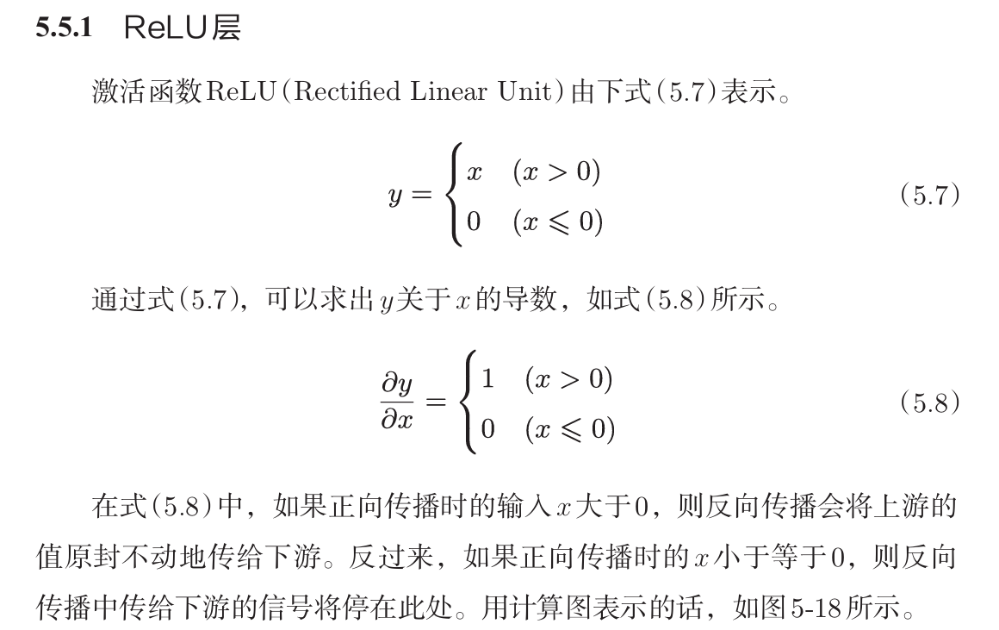
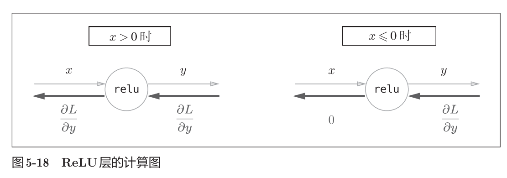
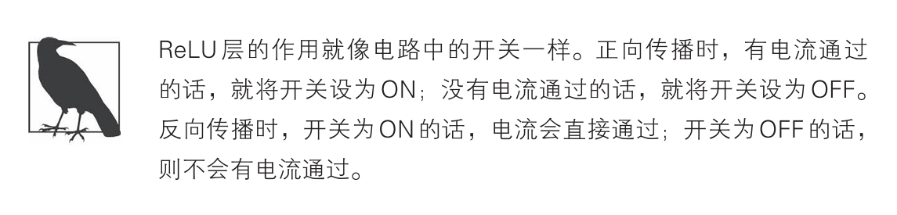

### Affine/Softmax层的实现 
神经网络的正向传播中进行的矩阵的乘积运算在几何学领域被称为“仿射变换”。因此，这里将进行仿射变换的处理实现为“Affine层”。

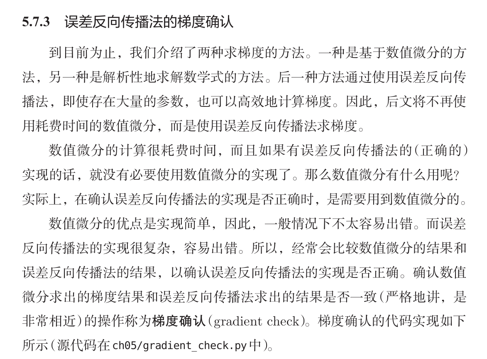

## 第六章： 与学习相关的技巧

### SGD
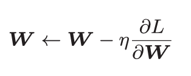

### Momentum
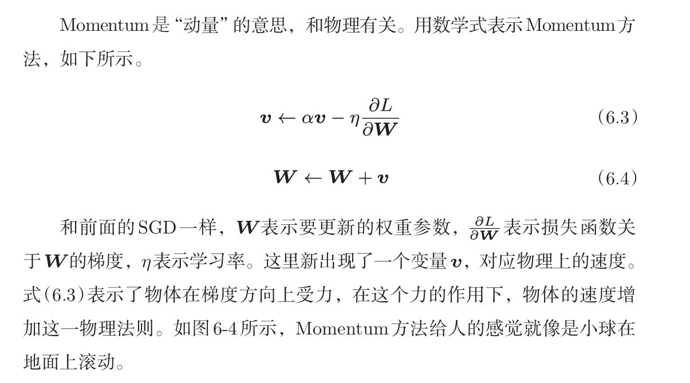

### AdaGrad
在关于学习率的有效技巧中，有一种被称为学习率衰减（learning rate decay）的方法，即随着学习的进行，使学习率逐渐减小。
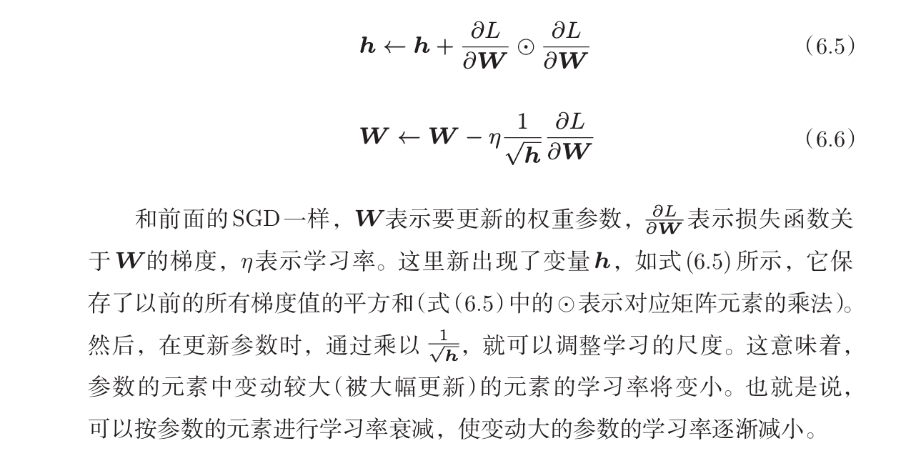

### Adam
Momentum参照小球在碗中滚动的物理规则进行移动，AdaGrad为参数的每个元素适当地调整更新步伐。如果将这两个方法融合在一起会怎么样,这就是Adam方法的基本思路
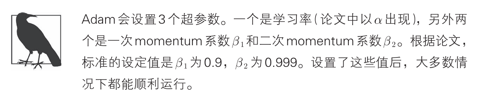

### 关于权重初始值
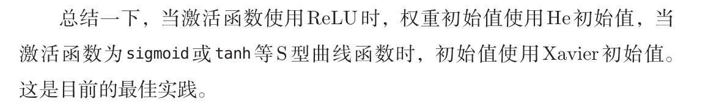

### 正则化
发生过拟合的原因，主要有以下两个。
• 模型拥有大量参数、表现力强。
• 训练数据少。

### 抑制过拟合的方法

#### 权值衰减
权值衰减是一直以来经常被使用的一种抑制过拟合的方法。该方法通过在学习的过程中对大的权重进行惩罚，来抑制过拟合。很多过拟合原本就是因为权重参数取值过大才发生的。

#### Dropout
Dropout是一种在学习的过程中随机删除神经元的方法。训练时，随机选出隐藏层的神经元，然后将其删除。被删除的神经元不再进行信号的传递，如图6-22所示。训练时，每传递一次数据，就会随机选择要删除的神经元。然后，测试时，虽然会传递所有的神经元信号，但是对于各个神经元的输出，要乘上训练时的删除比例后再输出。
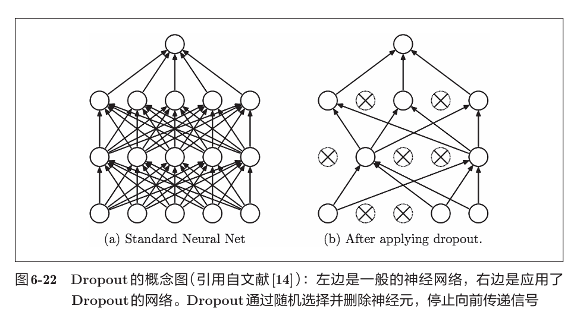

### 超参数的验证
这里所说的超参数是指，比如各层的神经元数量、batch大小、参数更新时的学习率或权值衰减等。
    这里要注意的是，不能使用测试数据评估超参数的性能。
    调整超参数时，必须使用超参数专用的确认数据。用于调整超参数的数据，一般称为验证数据（validation data）。我们使用这个验证数据来评估超参数的好坏
    (训练数据、验证数据、测试数据)
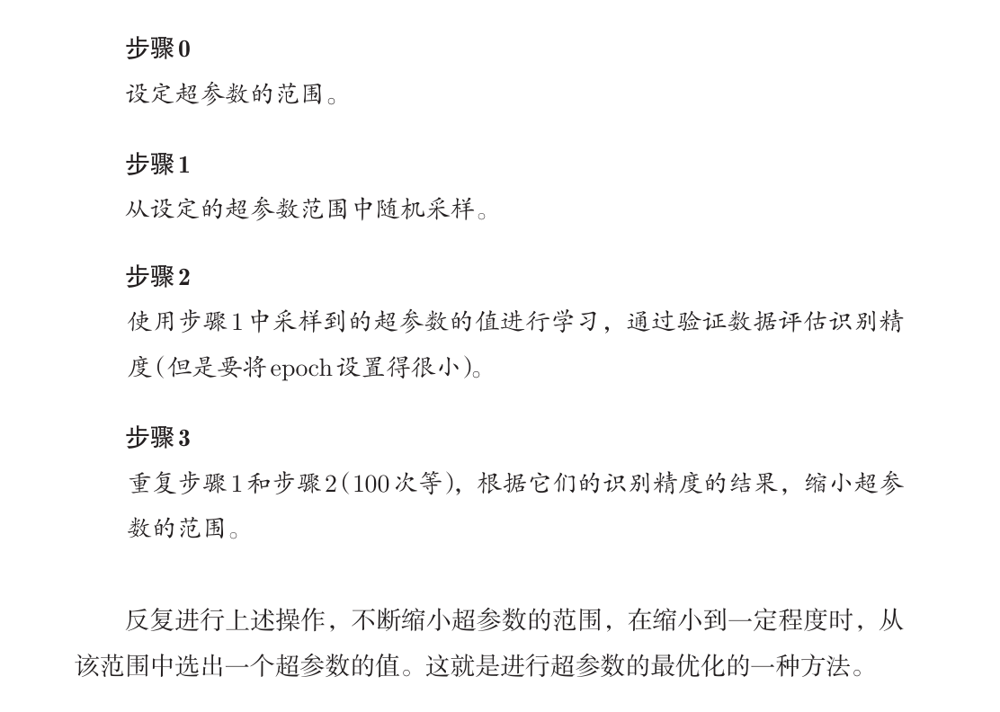

## 第七章 卷积神经网络
卷积神经网络（Convolutional Neural Network，CNN）
CNN中新出现了卷积层（Convolution层）和池化层（Pooling层）
### 卷积层

全连接层存在的问题：那就是数据的形状被“忽视”了。而卷积层可以保持形状不变。
将卷积层的输入输出数据称为特征图（feature map）。其中，卷积层的输入数据称为输入特征图（input feature map）， 输出数据称为输出特征图（output feature map）

#### 卷积运算
卷积层进行的处理就是卷积运算。卷积运算相当于图像处理中的“滤波器运算”。
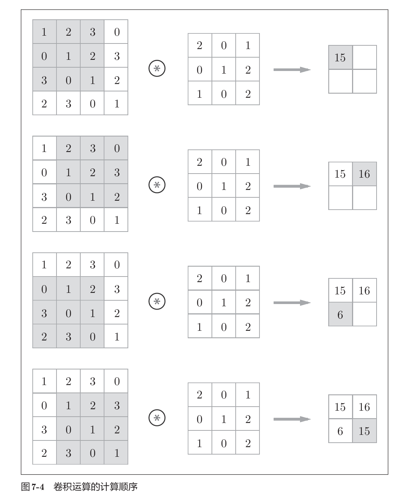

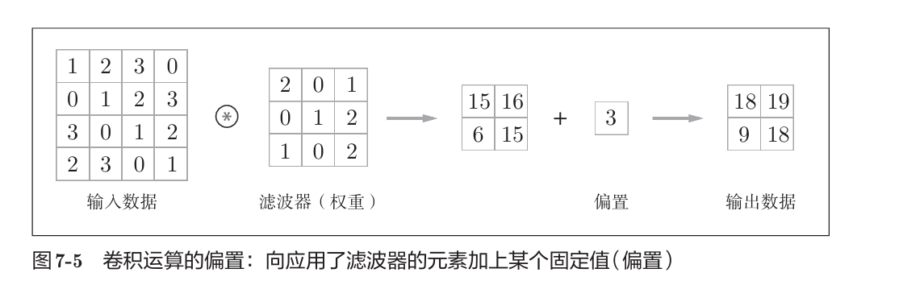

##### 填充
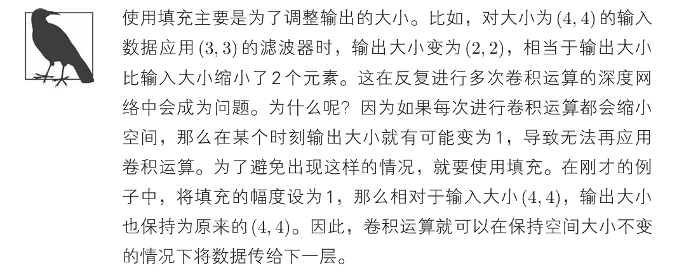

##### 步幅
应用滤波器的位置间隔称为步幅（stride）。之前的例子中步幅都是1，如果将步幅设为2，则如图7-7所示，应用滤波器的窗口的间隔变为2个元素。
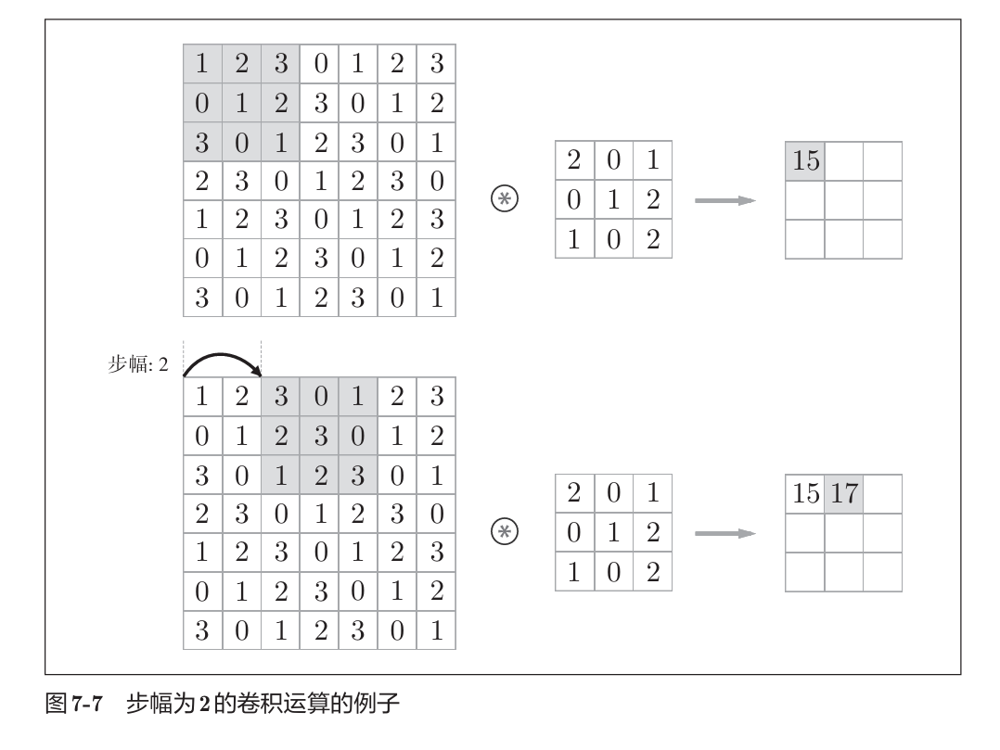

**综上，增大步幅后，输出大小会变小。而增大填充后，输出大小会变大。**

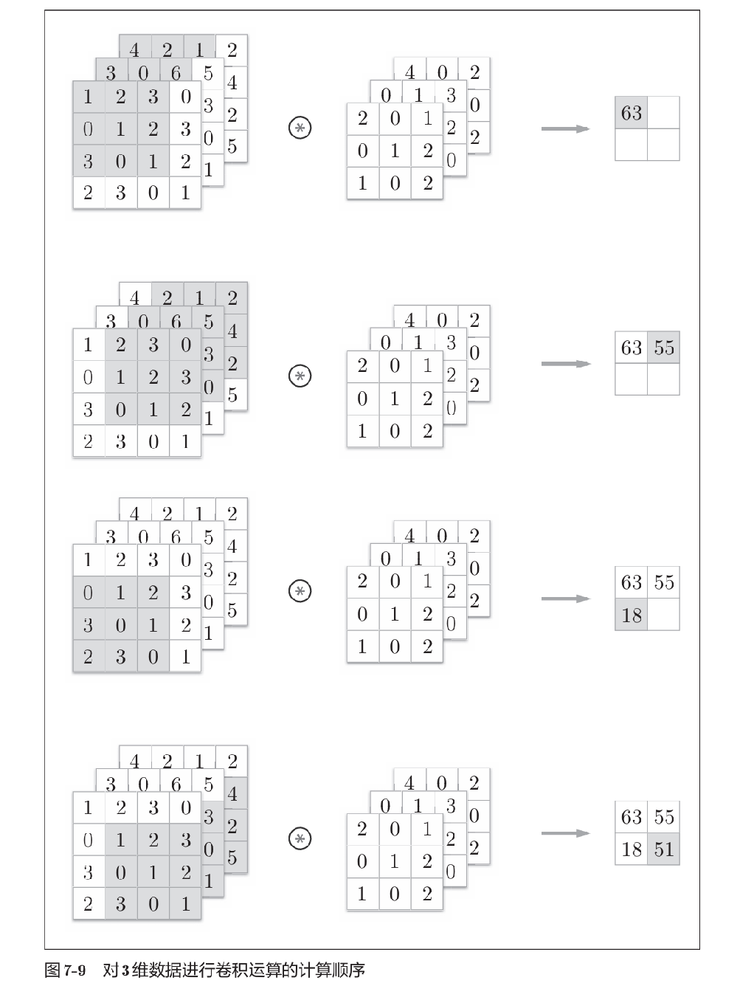
需要注意的是，在3维数据的卷积运算中，输入数据和滤波器的通道数要设为相同的值。在这个例子中，输入数据和滤波器的通道数一致，均为3。滤波器大小可以设定为任意值（不过，每个通道的滤波器大小要全部相同）。这个例子中滤波器大小为(3,3)，但也可以设定为(2,2)、(1,1)、(5,5)等任意值。再强调一下，通道数只能设定为和输入数据的通道数相同的值（本例中为3）

那么，如果要在通道方向上也拥有多个卷积运算的输出，该怎么做呢？为此，就需要用到多个滤波器（权重）。
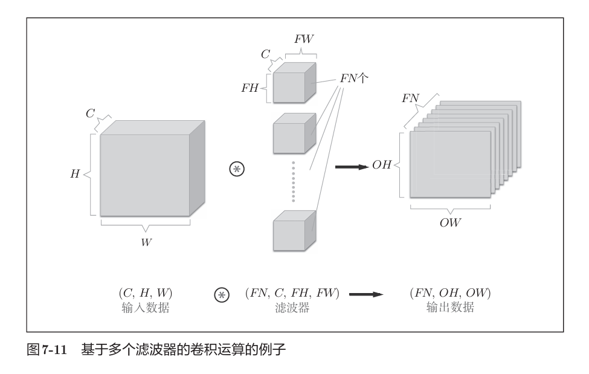

### 池化层
池化是缩小高、长方向上的空间的运算。比如，如图7-14所示，进行将2 ×2的区域集约成1个元素的处理，缩小空间大小。
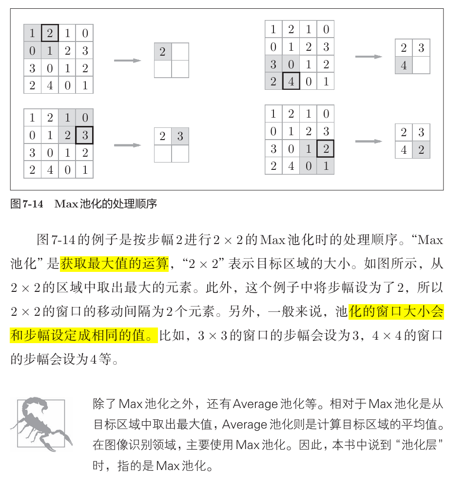

在图像处理领域，几乎毫无例外地都会使用CNN。

