# 深度学习笔记
时间：2024/11/30

### 1. 深度学习与神经网络

机器学习和深度学习的区别：
在特征提取上
• 机器学习的特征工程步骤是要靠手动完成的，而且需要大量领域专业知识
• 深度学习通常由多个层组成，它们通常将更简单的模型组合在一起，通过将数据从一层传递到另一层来构建更复杂的模型。通过大量数据的训练自动得到模型，不需要人工设计特征提取环节。

人工神经网络（ Artificial Neural Network， 简写为ANN）也简称为神经网络（NN）。是一种模仿生物神经网络（动物的中枢神经系统，特别是大脑）结构和功能的 计算模型。经典的神经网络结构包含三个层次的神经网络。分别输入层，输出层以及隐藏层。
•	神经网络的特点
o	每个连接都有个权值，同一层神经元之间没有连接
o	神经元当中会含有激活函数
o	最后的输出结果对应的层也称之为全连接层

逻辑回归
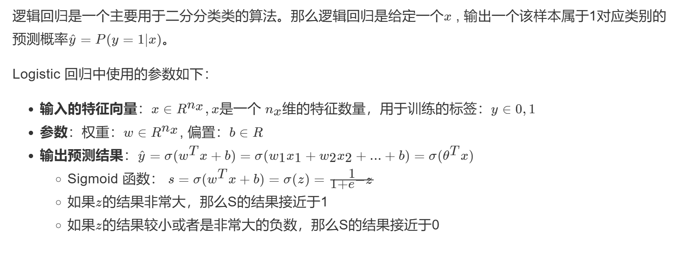

损失函数：用于衡量预测结果和真实值之间的误差。
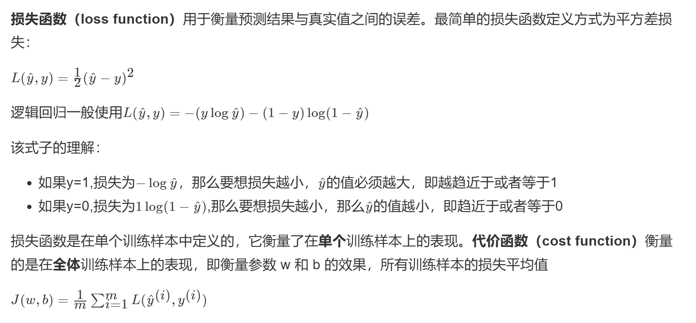

梯度下降算法
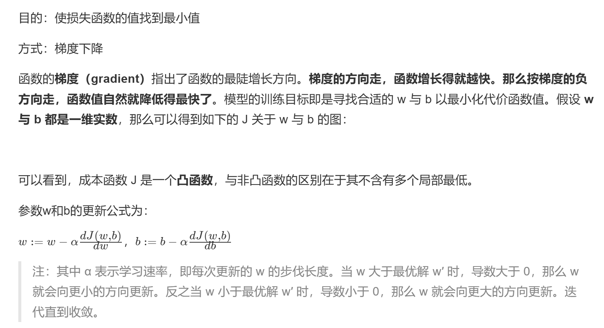

导数计算图与链式法则
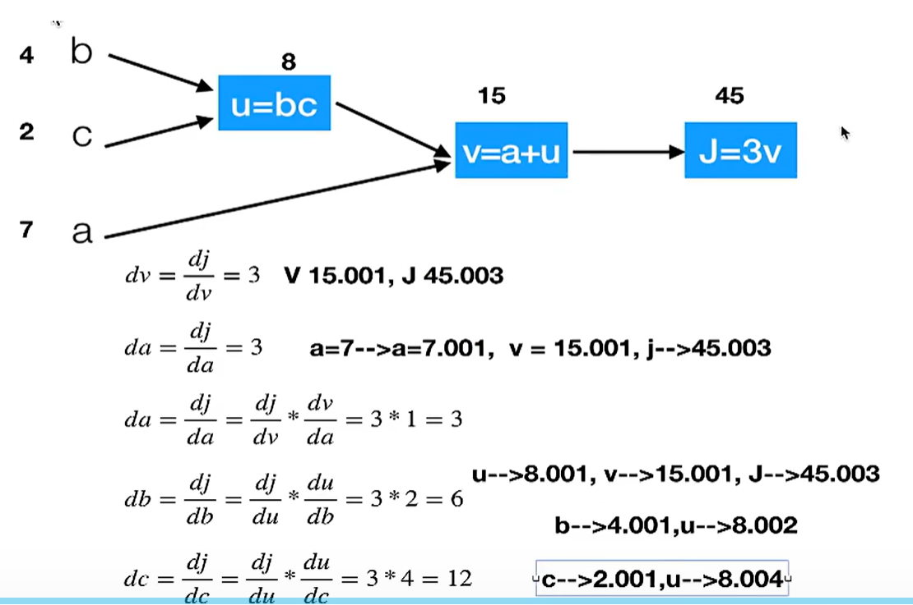

向量化编程：
避免使用for循环进行向量的计算
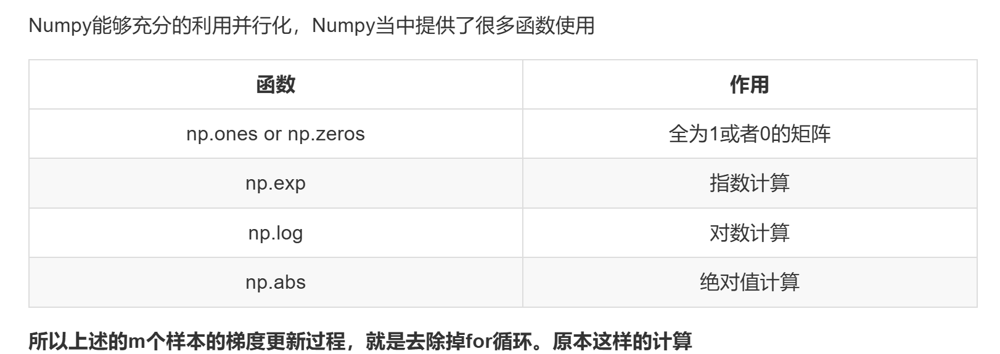

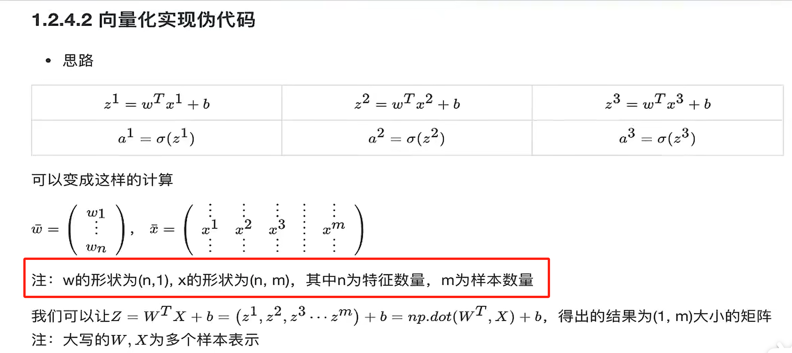

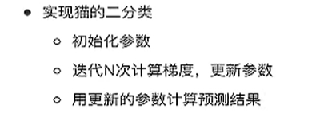

**为什么要使用非线性的激活函数？**

使用线性激活函数和不使用激活函数、直接使用 Logistic 回归没有区别，那么无论神经网络有多少层，输出都是输入的线性组合，与没有隐藏层效果相当，就成了最原始的感知器了。

**激活函数的选择**

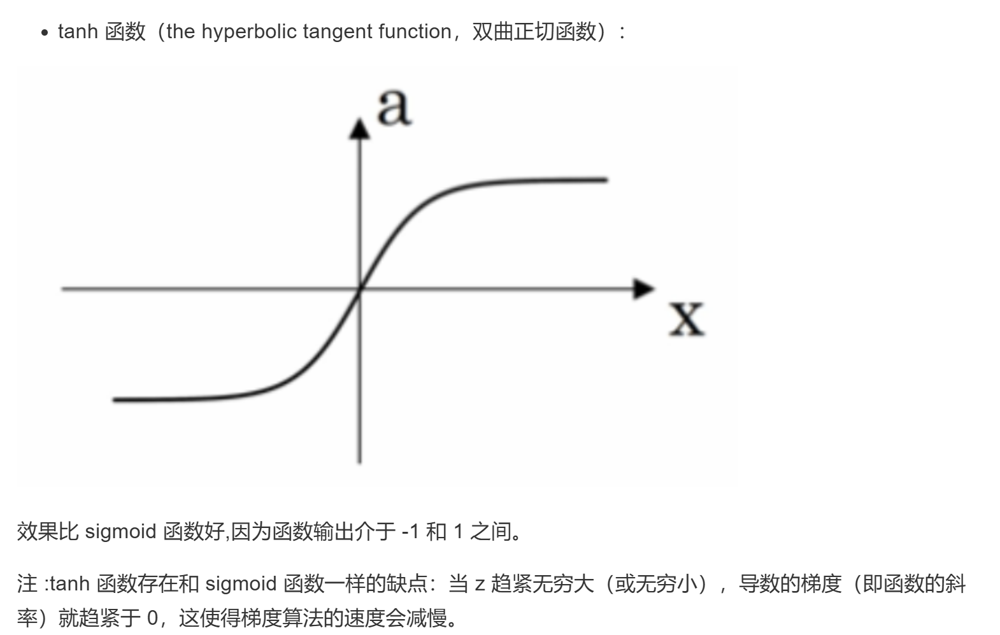

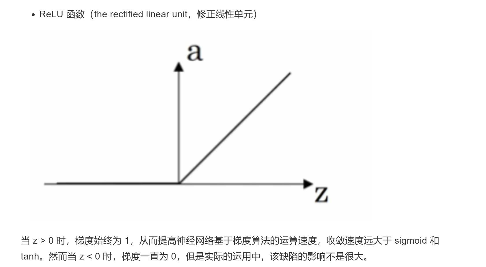

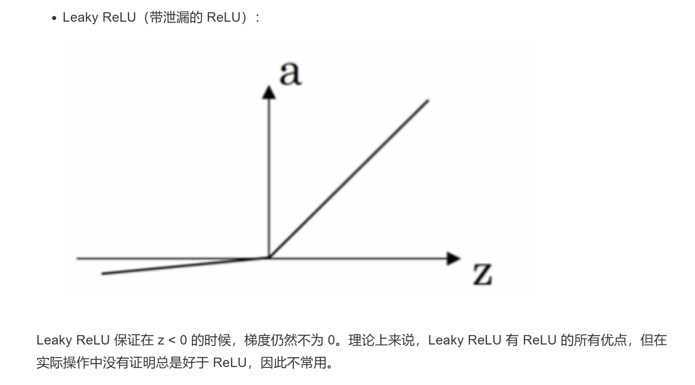

**前向传播**
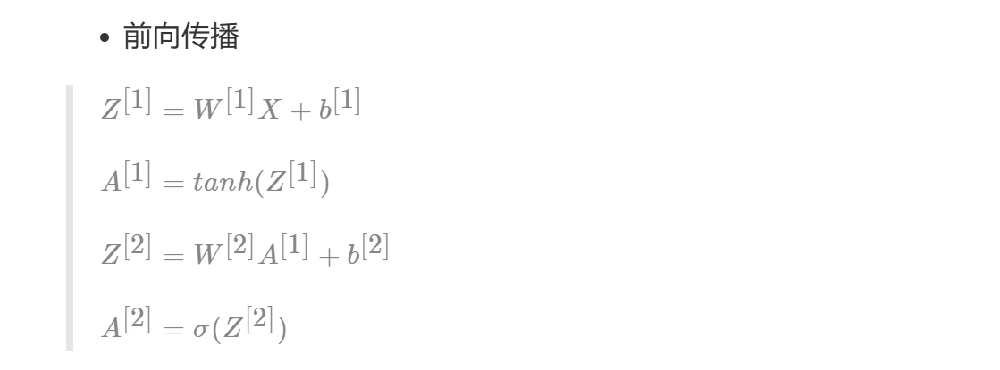
**反向传播：梯度下降**
就是求导
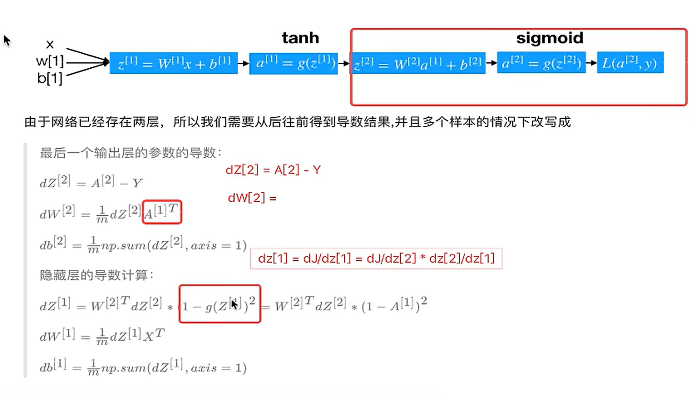

为什么使用深层神经网络？
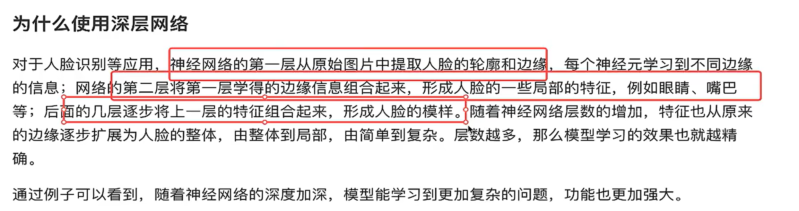

**超参数**

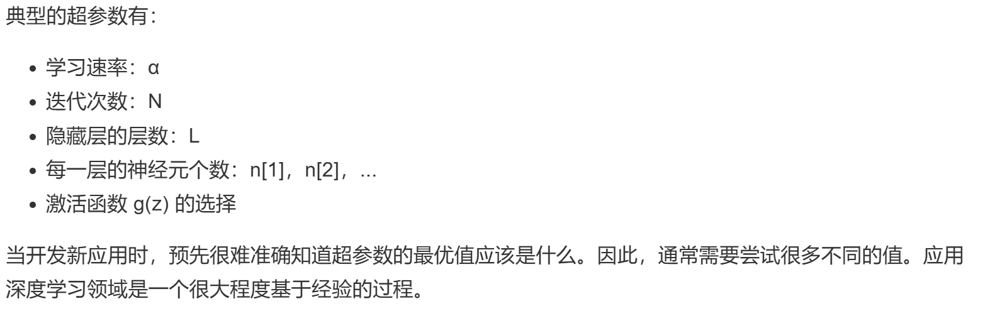

**为什么要随机初始化**
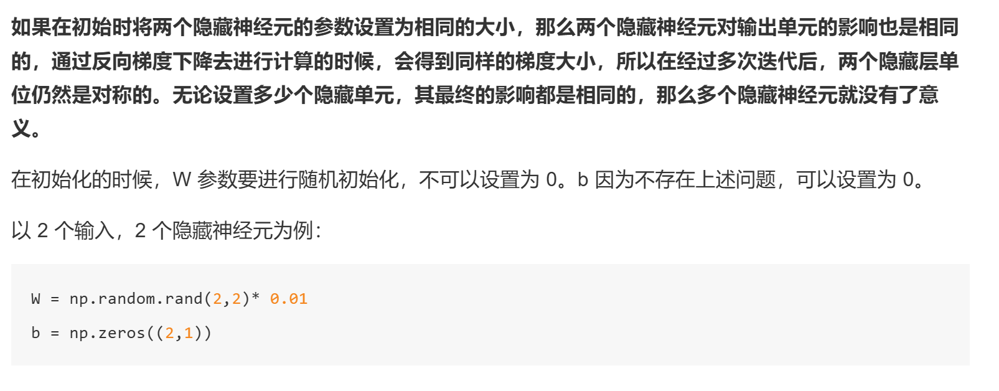

**初始化参数的值选择**
这里将 W 的值乘以 0.01（或者其他的常数值）的原因是为了使得权重 W 初始化为较小的值，这是因为使用 sigmoid 函数或者 tanh 函数作为激活函数时，W 比较小，则 Z=WX+b 所得的值趋近于 0，梯度较大，能够提高算法的更新速度。而如果 W 设置的太大的话，得到的梯度较小，训练过程因此会变得很慢。

ReLU 和 Leaky ReLU 作为激活函数时不存在这种问题，因为在大于 0 的时候，梯度均为 1。

### 2. 深度学习进阶
**多分类与softmax**
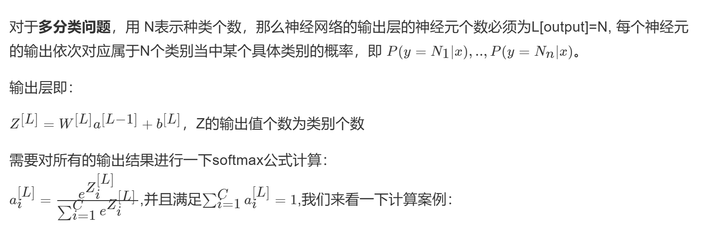

**交叉熵损失**
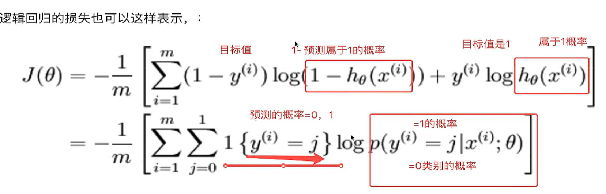

交叉熵损失函数的公式：
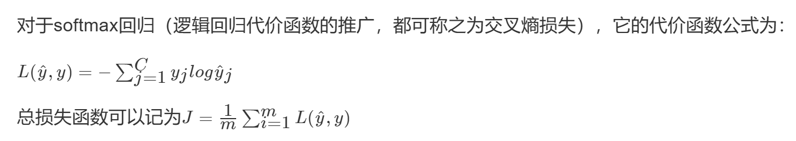

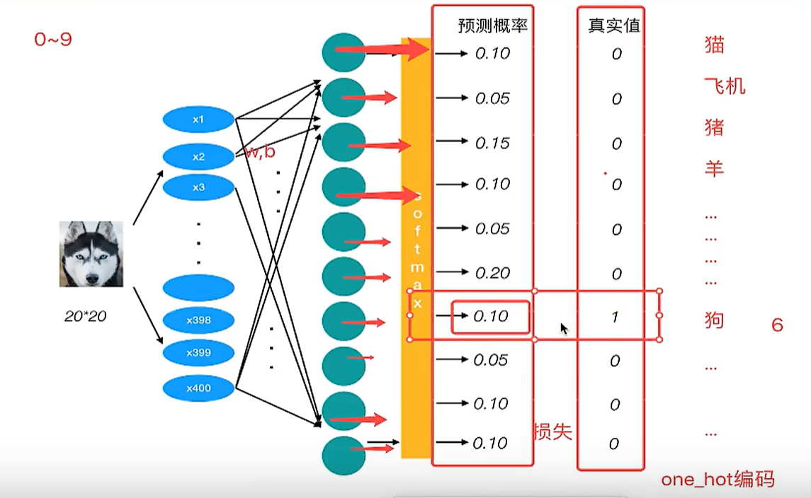

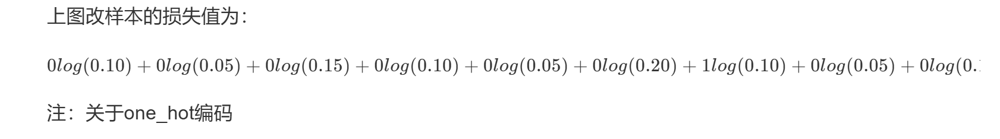

##### 案例：miniset手写数字识别

视频进度：41.09
